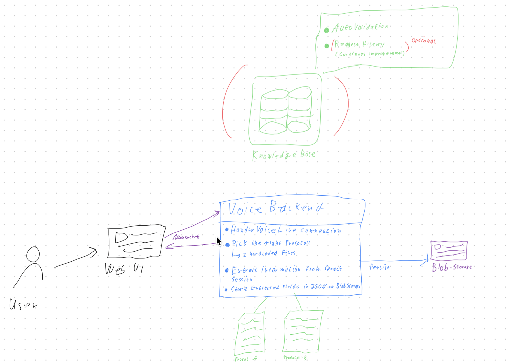

# GEA Voice Protocol Assistant

This project is a real-time voice assistant starter for the GEA field documentation workflow.

In the GEA use case, a consultant interacts with the assistant during or after a customer visit and protocollates what was observed on site. The assistant captures the spoken input, structures the key findings, and prepares a JSON payload that is ready for downstream processing and storage in Azure Blob Storage.

## Architecture

#file:Arch.png



## GEA Workflow

1. The consultant starts a session in the browser.
2. The consultant speaks about the customer situation, findings, issues, and actions.
3. The agent transcribes and extracts structured protocol fields.
4. The assistant asks follow-up questions for missing information.
5. The finalized protocol is exported as JSON.
6. The JSON is passed to the next processing step and can be persisted in Azure Blob Storage.

## What The Project Contains

- Real-time microphone capture in the browser
- WebSocket-based streaming between frontend and backend
- Azure Voice Live integration for STT, LLM response generation, and TTS
- Extraction agent that maps free speech into structured protocol fields
- JSON export endpoint/message for integration with data pipelines

## Repository Structure

```text
voicelive-webrtc-starter/
├── backend/
│   ├── agent.py
│   ├── app.py
│   ├── requirements.txt
│   └── voice_handler.py
├── frontend/
│   ├── app.js
│   ├── audio-capture.worklet.js
│   ├── audio-playback.worklet.js
│   ├── index.html
│   └── style.css
├── infra/
│   ├── main.bicep
│   └── README.md
├── doc/
│   └── Arch.png
├── Dockerfile
├── docker-compose.yml
└── README.md
```

## Prerequisites

- Azure subscription
- Azure AI Services resource with Voice Live enabled
- GPT model deployment (default: gpt-4o)
- Python 3.11+
- Modern browser

## Quick Start

### Local Python

```bash
git clone https://github.com/abeckDev/voicelive-webrtc-starter.git
cd voicelive-webrtc-starter
cp .env.sample .env
# Edit .env and provide Azure endpoint + credentials
pip install -r backend/requirements.txt
cd backend
python app.py
```

Open http://localhost:8000 and start a voice session.

### Docker

```bash
cp .env.sample .env
# Edit .env and provide Azure endpoint + credentials
docker compose up --build
```

Open http://localhost:8000.

## Runtime Message Flow

### Browser -> Backend

- `{"type":"start","config":{...}}` starts a voice session
- `{"type":"audio","data":"<base64 pcm>"}` streams audio chunks
- `{"type":"stop"}` ends the session
- `{"type":"export"}` requests current structured fields as JSON

### Backend -> Browser

- `session_ready`, `speech_start`, `speech_stop`
- transcript updates (consultant and assistant)
- assistant audio chunks
- `fields` updates with extracted protocol values
- `export` payload with JSON data
- error messages

## JSON Output For Blob Processing

The exported payload is intentionally structured for downstream processing. A typical integration path is:

1. Receive `export` JSON from the active session.
2. Enrich with metadata (customer id, consultant id, timestamp, engagement id).
3. Validate schema.
4. Store as a JSON document in Azure Blob Storage.
5. Trigger follow-up processing (for example, ETL, analytics, workflow automation).

Example shape:

```json
{
  "protocol": {
    "customer": "Contoso Foods",
    "location": "Hamburg",
    "findings": ["Line 3 temperature fluctuation", "Seal wear on unit A"],
    "actions": ["Calibrate sensor", "Plan seal replacement"]
  },
  "follow_up_hint": "Confirm planned maintenance date",
  "captured_at": "2026-06-29T10:30:00Z"
}
```

## Deployment

- Infrastructure templates are under `infra/`.
- Use the Bicep definitions to provision the Azure AI dependencies.
- Add Blob Storage resources and identity permissions if you want direct write-back from the backend.

## Notes For GEA Customization

- Update extraction schema in `backend/agent.py` to match GEA protocol fields.
- Update assistant behavior and prompts in `backend/voice_handler.py`.
- Add customer-specific form fields in `frontend/index.html` and rendering logic in `frontend/app.js`.
- If required, add a backend storage service that writes exported JSON to Blob Storage directly.

## License

MIT
